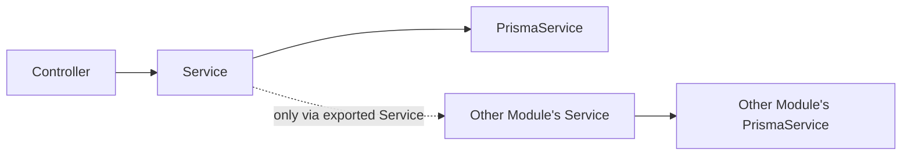
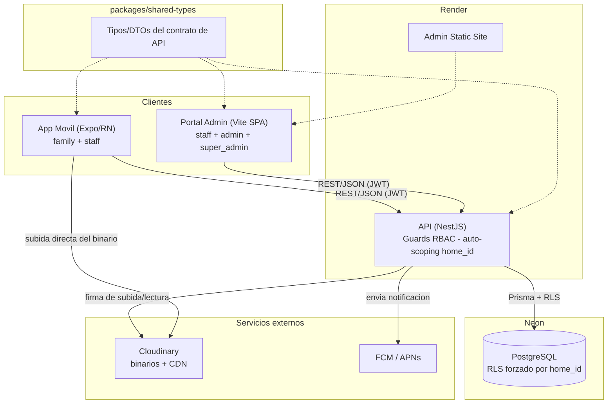

# Architecture Spine — Evergreen

## Design Paradigm

Feature-modular, layered backend (NestJS modules). Each business capability is a self-contained module (`auth`, `homes`, `users`, `residents`, `content`, `photos`, `events`, `meals`, `analytics`). Within a module, three fixed layers: **Controller** (HTTP + input validation) → **Service** (business logic) → **PrismaService** (data access, tenant-scoped). A module's exported Service is the *only* entry point another module may call — no module queries another module's tables directly, even for reads.



## Invariants & Rules

### AD-1 — Multi-tenant isolation is defense-in-depth

- **Binds:** all API/DB access (`all`)
- **Prevents:** any single missed `home_id` filter — an app bug, raw SQL, or a new endpoint — from leaking data across care homes.
- **Rule:** (1) auth middleware resolves the authenticated user's `home_id` into request-scoped context (`AsyncLocalStorage`); (2) a Prisma Client Extension auto-injects `home_id` into every query — a developer never writes the filter by hand; (3) every tenant-scoped table has Postgres Row-Level Security enforced with `FORCE ROW LEVEL SECURITY` (without `FORCE`, the table-owner role bypasses the policy); (4) every tenant-scoped table carries a composite index leading with `home_id`; (5) `super_admin` operations that legitimately span homes (e.g. listing all homes, platform analytics) opt out via a narrow `@BypassTenantScope()` decorator on that specific controller method only — never a global toggle — and every use is audit-logged with the acting user's id. Any cross-home access outside this sanctioned decorator is a bug, not a feature.
- **Home-id resolution is role-dependent:** (6) `staff`, `admin`, and `super_admin` resolve `home_id` from the JWT token payload (their home is fixed); (7) `family` resolves `home_id` from the `X-Active-Home-Id` request header, validated against the user's `HOME_MEMBERSHIP` rows at the auth middleware layer — the family user never has a `home_id` in their JWT. The Prisma Client Extension and RLS remain unchanged: they read `home_id` from `AsyncLocalStorage` regardless of how it was populated.

### AD-2 — Monorepo with a single API-contract source of truth

- **Binds:** `all`
- **Prevents:** API-contract drift and shared-type version skew between mobile, admin, and API, built by two people in parallel.
- **Rule:** one repository (pnpm workspaces, `workspace:*` protocol). `packages/shared-types` is the only place API request/response types are defined; `apps/api`, `apps/admin`, `apps/mobile` all import from it — none re-declares its own copy. CI validates the API's actual responses against these types.

### AD-3 — No client touches the database directly

- **Binds:** `apps/admin`, `apps/mobile`
- **Prevents:** the admin portal (or any future client) building a parallel data-access path — e.g. a server-side layer that queries Prisma directly — that bypasses the `home_id` auto-scoping and RBAC Guards in AD-1.
- **Rule:** `apps/admin` and `apps/mobile` reach data only via the NestJS REST API over JSON, authenticated with JWT. `apps/admin` is a static SPA (Vite) with no server-side data layer of its own.

### AD-4 — Media binaries live outside Postgres

- **Binds:** photo upload and display
- **Prevents:** divergent hardcoded transformation URLs between the gallery and full-screen views, and stale URLs if the transform strategy changes.
- **Rule:** the client requests a signed upload from the API (Cloudinary Node SDK) and uploads the binary directly to Cloudinary — not proxied through the API. Postgres stores only `cloudinary_public_id` (+ `home_id`, `resident_id`, `uploaded_by`, `caption`) — never a pre-built transformation URL; every view constructs its own transformation URL from the `public_id` at request time.

### AD-5 — Home content is one generic, typed table — and menus are not one of its types

- **Binds:** FR13–FR14, FR16–FR19 (Home Content Management: news, documents, schedules, notices, static pages, announcements)
- **Prevents:** five near-identical CRUD modules each independently implementing pagination, RBAC, and validation, with room to drift between them; and a second, competing "menu" model appearing in two modules at once.
- **Rule:** a single `ContentItem` table (`home_id`, `type` enum, `title`, `body`, `attachment_url`, `published_at`, `created_by`) backs the five content kinds above, served by the `content` module. `type` is a Prisma enum (`ContentType`), not a free string — extending it requires a migration (AD-6). **Weekly menus are explicitly not a `ContentItem` type**: FR15 ("view weekly menus") is the same data as FR37 (Meal Ordering) and is served by the `meals` module's read endpoint over `MEAL_MENU_ITEM` — one owner, one model, no duplicate. See *Deferred* for when to split a `ContentItem` type out into its own table.

### AD-6 — Schema migrations run only through CI/CD

- **Binds:** `all`
- **Prevents:** production schema drifting from what's committed in git.
- **Rule:** Prisma migrations against the production database execute only as a controlled step in the GitHub Actions pipeline on merge to `main` — never run ad hoc from a developer machine.

### AD-7 — Production deploys require a human approval gate

- **Binds:** `apps/api`, `apps/admin` production deploys
- **Prevents:** an automated deploy reaching real families/staff with no human checkpoint, given the sensitivity of resident data/photos and the small team's limited incident-response bandwidth.
- **Rule:** the GitHub Environments `production` environment requires a manual reviewer approval before the deploy step runs, even after CI passes. Revisit once the test suite has enough production track record.

### AD-8 — [ADOPTED] JWT auth with refresh-token renewal

- **Binds:** `auth` module, all clients
- **Prevents:** insecure session handling, silent auth failures, brute-forced login/reset endpoints, and open-ended password-reset links.
- **Rule:** JWT access + refresh tokens; refresh happens automatically; tokens are stored in the platform keychain on-device, never in plain storage (PRD FR6, NFR8). `@nestjs/throttler` rate-limits the login and password-reset endpoints specifically (NFR10). Password-reset issues a `PasswordResetToken` row with `expires_at` set 1 hour out, checked at consumption time — a used or expired token is always rejected (NFR9). The JWT payload carries `home_id` for `staff`, `admin`, and `super_admin` roles. `family` users have no `home_id` in their JWT — their active home is resolved per-request via the `X-Active-Home-Id` header (AD-18).

### AD-9 — [ADOPTED] Photo pipeline resilience

- **Binds:** `photos` module, mobile upload flow
- **Prevents:** upload failures on poor care-home WiFi from silently losing photos, and unbounded storage growth.
- **Rule:** client compresses to max 1920px / ~300KB before upload; failed uploads retry with backoff (30s → 2min → 5min, stop after 3 attempts); 10MB max file size enforced client + API; photos older than 12 months archive to cold storage.

### AD-10 — [ADOPTED] Push notifications are home-scoped, tracked, and deep-link-ready

- **Binds:** notification dispatch (cross-cutting, lives in `apps/api/src/notifications`)
- **Prevents:** a push notification reaching a device outside the resident's home; delivery failures going unnoticed (NFR14); the mobile client having no reliable way to route a tapped notification to the right screen.
- **Rule:** device tokens keyed `(user_id, device_token, platform, home_id)`; every dispatch query filters by `home_id`; an FCM/APNs `InvalidRegistration` response marks the token dead, re-registered on next app launch. Every send is recorded with a delivery status (`sent | failed | dead_token`) for staff-visible tracking (NFR14). Every payload carries a stable typed shape `{ type, entityId, route }` so the client can deep-link reliably (EXPERIENCE.md).

### AD-11 — Family-to-resident scoping is a Guard, not just tenant scoping

- **Binds:** every family-facing endpoint that takes a `residentId` (`photos`, `events` registration, `meals` orders, resident profile)
- **Prevents:** a family member seeing or acting on a resident within their *own* home who isn't *their* linked resident — AD-1 only closes the cross-home gap, not this finer one.
- **Rule:** a `FamilyResidentGuard` checks **both** (1) a `FAMILY_LINK` row exists for `(user_id, resident_id)` AND (2) the user has a `HOME_MEMBERSHIP` in the `home_id` of the target resident — before the request reaches the Service, applied at the controller level. Staff/admin/super_admin are exempt (they're already scoped by `home_id` or global per AD-1). The dual check prevents a family member who has links to residents across multiple homes from acting on a resident whose home they no longer have access to.

### AD-12 — RBAC is a first-class mechanism

- **Binds:** `all`
- **Prevents:** one module comparing `role !== 'Admin'` while another compares `role !== 'admin'` — both technically AD-compliant, one silently broken.
- **Rule:** `User.role` is a Prisma enum (`Role: family | staff | admin | super_admin`), not a free string. Every protected endpoint declares its required roles via a `@Roles(...)` decorator, enforced by one global `RolesGuard` — no inline role-string comparisons in a Controller or Service.

### AD-13 — API evolution is additive-only; breaking changes are versioned

- **Binds:** `apps/api`, `packages/shared-types`
- **Prevents:** an already-installed mobile build (store review + OTA lag means several versions are live at once) silently breaking against an API that changed under it.
- **Rule:** the default change path only adds optional fields — never removes, renames, or retypes an existing one. A genuine breaking change ships as a new versioned route prefix (`/v2/...`) alongside the old one, kept alive until the old client build is confirmed out of meaningful use. The mobile client sends its build number in a request header; the API logs it (never rejects on it) so drift is visible.

### AD-14 — [ADOPTED] Transactional email via Resend

- **Binds:** password reset (FR3), user invites (FR11)
- **Prevents:** hand-rolling deliverability/retry infrastructure a managed provider already solves, and the setup/ops overhead of a sandboxed provider at this team's scale.
- **Rule:** Resend is the transactional email provider. NFR15's retry policy (3 retries: 60s → 5min → 30min on transient failure) is implemented in application logic wrapping the Resend call, not a Resend-native feature.

### AD-15 — Observability: one dashboard across all three apps

- **Binds:** `all`
- **Prevents:** AD-7's production deploy gate resting on "limited incident-response bandwidth" as a rationale while having no actual visibility to catch an incident.
- **Rule:** Sentry across `apps/api` (NestJS), `apps/admin` (React), and `apps/mobile` (React Native) — one dashboard, error tracking + basic performance monitoring. Free-tier volume is sufficient at this project's current scale. A Cloudinary/Render billing alert fires at $50/month (PRD's own named cost mitigation).

### AD-16 — Mobile client data layer: TanStack Query, on both clients

- **Binds:** `apps/mobile`, `apps/admin`
- **Prevents:** the mobile app having no real mechanism for the PRD's "cached content shown offline" requirement, and the team learning two different data-fetching libraries for two clients that hit the same API.
- **Rule:** `apps/mobile` uses TanStack Query (same library as `apps/admin`) with a persisted cache (`AsyncStorage`-backed query persister) — a screen navigated to while online renders from cache when the network drops, satisfying the PRD's graceful-degradation offline strategy without a local database or conflict resolution (both explicitly out of scope for V1).

### AD-17 — Database connections go through Neon's pooler

- **Binds:** `apps/api` → Neon
- **Prevents:** connection exhaustion at NFR12's 2,000-concurrent-user target — a horizontally-scaled API on Render, each holding its own Prisma connection pool, against serverless Postgres is the classic way this fails.
- **Rule:** Prisma's `DATABASE_URL` points at Neon's pooled (PgBouncer-compatible) connection string, not the direct one; Prisma's own `connection_limit` is tuned per Render instance so the total across instances stays under Neon's pooled ceiling.

### AD-18 — Family home context is session-scoped, not token-scoped

- **Binds:** `auth` module, `apps/mobile`, `apps/admin` (family flows)
- **Prevents:** a family member with access to multiple homes from being locked into a single home by their JWT, or having to re-authenticate to switch homes.
- **Rule:** `family` users carry no `home_id` in their JWT. On every request, the client sends the desired active home in the `X-Active-Home-Id` header. Auth middleware validates the header value against the user's `HOME_MEMBERSHIP` rows and populates `AsyncLocalStorage` with it. The active home persists client-side in-memory during a session (alongside the resident-switcher selection in UX-DR9); changing it re-scopes all visible data without re-authentication. `staff`, `admin`, and `super_admin` users are unaffected — their `home_id` remains in the JWT, fixed.

## Consistency Conventions

| Concern | Convention |
| --- | --- |
| Naming (entities, files, interfaces) | Prisma models & DB columns `snake_case` (via `@map`); API JSON `camelCase`; one NestJS module per business capability |
| Enums over free strings | `Role` and `ContentType` are Prisma enums, never a plain `string` column (AD-12, AD-5) — extending either is a migration, not a silent app-layer allow-list |
| IDs | UUID v4 for every primary key |
| Dates | ISO 8601, UTC, in every API payload |
| Error envelope | `{ error: { code, message, details? } }` + correct HTTP status code on every endpoint |
| Pagination | Offset/limit: `{ data: [...], meta: { page, pageSize, total } }` on every list endpoint — **except** CSV export endpoints, which are a named exception: they stream the full result set (up to the 5,000-row NFR ceiling) as CSV, never paginated (NFR16) |
| State & mutation | A module's own `Service` is the only place its data mutates — never from a `Controller` directly, never from another module |
| Logging | Structured JSON logs, every line carries a `request_id` correlation field |
| Config | Environment variables validated at process boot — fail fast, never run partially configured |
| Transport & at-rest encryption | TLS 1.2+ and encryption at rest (NFR5, NFR6) are inherited from Render/Neon/Cloudinary managed defaults — stated here explicitly rather than left unstated |

## Stack

| Name | Version |
| --- | --- |
| pnpm (workspaces) | 10.x |
| NestJS | 11 (Express v5 adapter; swappable to Fastify without app rewrite) |
| Prisma | 7 (TS-native runtime) |
| PostgreSQL | 17 (Neon-hosted) — deliberately not Neon's new default of 18, which still runs `io_method=sync` during its preview/stability period as of mid-2026; revisit once Neon's async I/O for 18 is out of preview |
| React Native / Expo | Expo SDK 57 (RN ~0.85+ / React 19.2 lineage) |
| React Native Reusables / NativeWind | NativeWind 4.2.x (v5 is pre-release, not production-ready — stay on v4) |
| Vite + React | Vite 8.1.x |
| shadcn/ui | CLI v4 (Mar 2026) — components remain copy-paste/unversioned by design |
| TanStack Router (admin) / TanStack Query (admin + mobile) | Router 1.170.x / Query 5.101.x (AD-16) |
| @nestjs/throttler | latest (AD-8) |
| Cloudinary | — (managed service) |
| Render | Web Service + Static Site |
| Neon | Postgres, branch-per-PR |
| GitHub Actions | — |
| Expo EAS (Build + Update) | latest |
| Resend | — (managed service, AD-14) |
| Sentry | Developer (free) plan (AD-15) |

## Structural Seed

### System / Container View



### Core-Entity ERD

```mermaid
erDiagram
    HOME { uuid id }
    USER { uuid id, string role }
    HOME_MEMBERSHIP { uuid id, uuid user_id, uuid home_id, string role }
    RESIDENT { uuid id, uuid home_id }
    FAMILY_LINK { uuid user_id, uuid resident_id }
    CONTENT_ITEM { uuid id, uuid home_id, string type }
    PHOTO { uuid id, uuid home_id, uuid resident_id, string cloudinary_public_id }
    EVENT { uuid id, uuid home_id }
    EVENT_REGISTRATION { uuid id, uuid event_id, uuid resident_id, uuid requested_by_user_id }
    MEAL_MENU_ITEM { uuid id, uuid home_id, date day }
    MEAL_ORDER { uuid id, uuid menu_item_id, uuid resident_id, uuid ordered_by_user_id }
    DEVICE_TOKEN { uuid id, uuid user_id }

    USER ||--o{ HOME_MEMBERSHIP : "belongs to"
    HOME ||--o{ HOME_MEMBERSHIP : "has members"
    HOME ||--o{ RESIDENT : "houses"
    HOME ||--o{ CONTENT_ITEM : "publishes"
    HOME ||--o{ EVENT : "hosts"
    HOME ||--o{ MEAL_MENU_ITEM : "offers"
    USER ||--o{ FAMILY_LINK : "links to"
    RESIDENT ||--o{ FAMILY_LINK : "linked by"
    RESIDENT ||--o{ PHOTO : "tagged in"
    USER ||--o{ DEVICE_TOKEN : "registers"
    EVENT ||--o{ EVENT_REGISTRATION : "has"
    RESIDENT ||--o{ EVENT_REGISTRATION : "signed up for"
    USER ||--o{ EVENT_REGISTRATION : "requested by"
    MEAL_MENU_ITEM ||--o{ MEAL_ORDER : "ordered as"
    RESIDENT ||--o{ MEAL_ORDER : "ordered for"
    USER ||--o{ MEAL_ORDER : "ordered by"
```

### Deployment & Environments

| Environment | Database | API + Admin | Mobile |
| --- | --- | --- | --- |
| Local | Neon personal branch (or local Postgres) | `pnpm dev` (all workspaces) | Expo dev client |
| PR (ephemeral) | Fresh Neon branch, created and destroyed by CI | tests only | — |
| Staging | Persistent Neon `staging` branch | Render staging, auto-deploy on push to `staging` | EAS `preview` channel |
| Production | Neon production branch | Render production, deploy gated by manual approval (AD-7) | EAS `production` channel + store submission |

### Source Tree

```text
evergreen/
  apps/
    api/                  # NestJS — REST API
      src/
        auth/              # JWT, refresh tokens, RBAC guards
        homes/             # home CRUD (super admin)
        users/             # profiles, invitations, roles
        residents/         # residents + family links
        content/           # generic ContentItem (AD-5) — news/notice/announcement/static_page/document/schedule only
        photos/            # metadata + Cloudinary signed upload (AD-4)
        events/            # events + registrations + CSV export
        meals/             # weekly menu (incl. FR15) + orders + CSV export (AD-5)
        notifications/     # push dispatch (AD-10) + transactional email via Resend (AD-14)
        analytics/         # dashboard aggregates (computed, no dedicated event store — see Deferred)
        prisma/            # schema.prisma, migrations, RLS policies
    admin/                 # Vite + React + shadcn/ui — staff/admin/super-admin portal
      src/
    mobile/                # Expo React Native — family/staff app
      src/
  packages/
    shared-types/          # API contract types (AD-2), consumed by api+admin+mobile
```

## Capability → Architecture Map

| Capability / Area | Lives in | Governed by |
| --- | --- | --- |
| Auth & Onboarding (FR1–FR12) | `apps/api/src/auth`, `users` | AD-8, AD-12, AD-14 (invites/reset email) |
| Home Content Management (FR13–FR14, FR16–FR19) | `apps/api/src/content` | AD-5, AD-12 |
| Residents & Family Mapping (FR20–FR23) | `apps/api/src/residents` | Design Paradigm, AD-1, AD-11 |
| Photo Sharing (FR24–FR27) | `apps/api/src/photos` | AD-4, AD-9, AD-11 |
| Events & Outings (FR28–FR36) | `apps/api/src/events` | Design Paradigm, AD-11 |
| Meal Ordering incl. weekly menu view (FR15, FR37–FR42) | `apps/api/src/meals` | Design Paradigm, AD-5, AD-11 |
| Push Notifications (FR43–FR46) | `apps/api/src/notifications` | AD-10 |
| Admin & Staff Management (FR47–FR53) | `apps/api/src/homes`, `users` | AD-1 (incl. AD-1's `@BypassTenantScope`), AD-12 |
| Analytics & Dashboard (FR54–FR55) | `apps/api/src/analytics` | AD-1's bypass escape hatch; see Deferred |

### NFR Coverage

| NFR | Governed by |
| --- | --- |
| NFR1 (mobile <2s), NFR3 (thumbnails <1s) | AD-4, AD-16 |
| NFR2 (API p95 <200ms) | AD-1 (home_id-leading indexes), AD-15 (detection) |
| NFR4 (push <30s) | AD-10 |
| NFR5, NFR6 (TLS, encryption at rest) | Consistency Conventions |
| NFR7 (tenant isolation) | AD-1, AD-11 |
| NFR8 (token storage) | AD-8 |
| NFR9 (reset link expiry) | AD-8 |
| NFR10 (auth rate limiting) | AD-8 |
| NFR11 (new homes, no code change) | Design Paradigm, AD-1 |
| NFR12 (2,000 concurrent users) | AD-17 |
| NFR13 (50k photos) | AD-9 |
| NFR14 (push delivery tracking) | AD-10 |
| NFR15 (email retry) | AD-14 |
| NFR16 (CSV export) | Consistency Conventions (pagination exception) |

## Deferred

- **Google Sheets sync** (events + meals) — Post-MVP per PRD; CSV export covers V1.
- **Splitting a `ContentItem` type into its own table** — only if a type (e.g. schedules) grows real structured data beyond title/body/attachment; not preemptive (AD-5).
- **Fastify adapter for NestJS** — swap from the default Express v5 adapter only if throughput actually becomes a bottleneck; not needed at this project's scale.
- **Cursor-based pagination** — offset/limit is sufficient at current list sizes; revisit if a list grows large enough for offset cost to matter.
- **Removing the manual production deploy gate (AD-7)** — once the automated test suite (especially the tenant-isolation suite) has enough production track record to trust fully.
- **Revisit AD-9's archival policy** once photo count approaches NFR13's 50,000 ceiling, to confirm the 12-month cold-storage cutoff is still the right trigger rather than a count-based one.
- **Dedicated analytics event-tracking store** — V1 computes dashboard metrics via aggregate queries over existing tables; a proper event pipeline is deferred until dashboard needs outgrow that.
- **Schema-per-tenant or dedicated infrastructure for a single home** — not needed now; shared-schema + RLS (AD-1) covers the isolation requirement at 12–20 homes.
